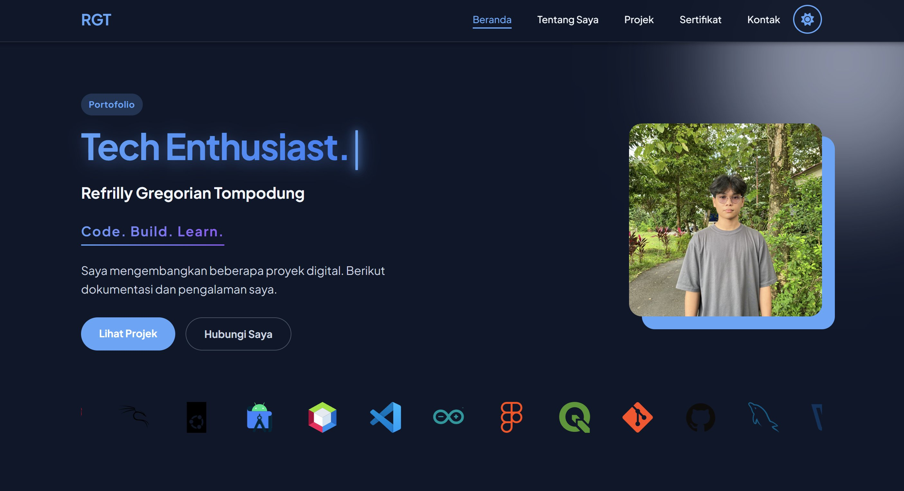

<div align="center">

<a href="https://github.com/Refrillygt">
  
</a>

<br/><br/>

```
██████╗ ███████╗███████╗██████╗ ██╗██╗     ██╗  ██╗   ██╗
██╔══██╗██╔════╝██╔════╝██╔══██╗██║██║     ██║  ╚██╗ ██╔╝
██████╔╝█████╗  █████╗  ██████╔╝██║██║     ██║   ╚████╔╝ 
██╔══██╗██╔══╝  ██╔══╝  ██╔══██╗██║██║     ██║    ╚██╔╝  
██║  ██║███████╗██║     ██║  ██║██║███████╗███████╗██║   
╚═╝  ╚═╝╚══════╝╚═╝     ╚═╝  ╚═╝╚═╝╚══════╝╚══════╝╚═╝   
```


### ⚡ Refrilly Gregorian Tompodung — Full-Stack Developer

*"Any fool can write code that a computer can understand.*
*Good programmers write code that **humans** can understand."*
— Martin Fowler

[](https://instagram.com/refrillygt_)
[](https://linkedin.com/in/Refrillygt)
[](https://portofolio-refrilly.vercel.app/)
[](https://github.com/Refrillygt)

</div>

---

## 🚀 About Me

```yaml
name: Refrilly Gregorian Tompodung
location: Manado, North Sulawesi 🇮🇩
focus: Full-Stack Web Development
interests: [Web Dev, Networking, Cybersecurity, Gaming]
currently_learning: Next.js
portfolio: https://portofolio-refrilly.vercel.app/
```

---

## 🌐 Portfolio Preview

<div align="center">

[](https://portofolio-refrilly.vercel.app/)

**🔗 [portofolio-refrilly.vercel.app](https://portofolio-refrilly.vercel.app/)**

</div>

---

## 🛠️ Tech Stack

### 💻 Programming & Frameworks


### 🗄️ Database


### 🎨 Design & Tools


### 🔧 Dev Tools & IDEs


### 🖥️ OS & Networking


### 🎮 Gaming


---

## 📊 GitHub Stats

<div align="center">


</div>

<div align="center">


</div>

---

## 🏆 Top Contributed Repos

<div align="center">


</div>

---

## 📈 Contribution Graph

<div align="center">


</div>

---

<div align="center">

**💡 Open to collaborations and new projects!**

*Building things that matter, one commit at a time.*

</div>
